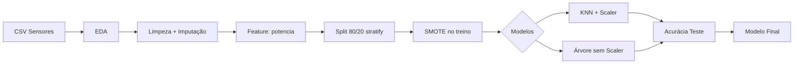

# PredictGuard – Manutenção Preditiva na Indústria 4.0

Sistema de **Machine Learning** para prever falhas mecânicas em equipamentos industriais monitorados por sensores, evitando paradas não planejadas na linha de produção.

## Problema

Um parque fabril com máquinas instrumentadas por sensores de temperatura, rotação, torque e desgaste de ferramenta precisa antecipar quebras mecânicas. A variável alvo é binária:

| Valor | Significado |
|-------|-------------|
| `0` | Operação normal |
| `1` | Falha mecânica detectada |

## Solução

Pipeline preditivo ponta a ponta em Python, organizado em **7 fases**:

1. **EDA** – dimensões, tipos, `describe()`, histogramas, desbalanceamento e correlação
2. **Data Prep** – remoção de duplicatas, imputação por mediana, boxplots de outliers
3. **Feature Engineering** – variável `potencia = velocidade_rotacao_rpm × torque_nm`
4. **Divisão e Balanceamento** – split 80/20 com `stratify` + SMOTE no treino
5. **Escalonamento** – `StandardScaler` apenas para KNN
6. **Hiperparâmetros** – KNN (`K=3,5,7`) e Árvore (`max_depth=3,5,None`)
7. **Veredito Final** – comparação de acurácia no teste e modelo recomendado

## Estrutura do repositório

```
predictguard/
├── predictguard.ipynb          # Notebook principal (entrega)
├── data/
│   └── manutencao_preditiva.csv
├── requirements.txt
├── README.md
└── scripts/
    ├── gerar_notebook.py
    └── validar_pipeline.py
```

## Tecnologias

| Biblioteca | Uso |
|------------|-----|
| **Pandas** | Manipulação e limpeza de dados |
| **NumPy** | Operações numéricas |
| **Matplotlib / Seaborn** | Gráficos analíticos (EDA, boxplots, correlação) |
| **Scikit-learn** | KNN, Árvore de Decisão, StandardScaler, split |
| **imbalanced-learn** | SMOTE para balanceamento do treino |
| **Jupyter** | Ambiente de execução do notebook |

## Como executar

### Pré-requisitos

- Python 3.10 ou superior
- pip

### Instalação

```bash
git clone <url-do-repositorio>
cd salesinsight-py
pip install -r requirements.txt
```

### Executar o notebook

```bash
jupyter notebook predictguard.ipynb
```

Ou no VS Code: abra `predictguard.ipynb` e execute todas as células.

### Validar o pipeline via script

```bash
python scripts/validar_pipeline.py
```

## Fluxo do pipeline



## Decisões técnicas

- **Mediana** para imputação: robusta a outliers em RPM e torque.
- **SMOTE** (não undersampling): preserva informação da classe majoritária.
- **Sem escalonamento na Árvore**: o algoritmo é imune à escala dos atributos.
- **Exclusão de `falha_twf/hdf/pwf/osf/rnf`**: são motivos da falha, não preditores (conforme anotações de engenharia).

## GitFlow

| Branch | Finalidade |
|--------|------------|
| `main` | Versão estável entregue |
| `develop` | Integração de features |
| `feat/eda` | Fase 1 – Análise Exploratória |
| `feat/data-prep` | Fase 2 – Limpeza e tratamento |
| `feat/feature-engineering` | Fase 3 – Nova variável potencia |
| `feat/modelagem` | Fases 4–7 – Split, modelos e avaliação |
| `docs/readme` | Documentação |

## Melhorias futuras

- Métricas para classes desbalanceadas (Precision, Recall, F1-Score)
- Validação cruzada estratificada (k-fold)
- Modelos ensemble (Random Forest, XGBoost)
- API REST para integração com sensores em tempo real
- Dashboard de monitoramento com alertas preditivos

## Entrega no AVA

Enviar até **20/07/2026, 22h**:

1. Link do repositório público no GitHub
2. Link do vídeo (Google Drive, modo leitor) — máximo 7 minutos

## Autor

Projeto avaliativo – Módulo 1 (Ciência de Dados / Machine Learning).

